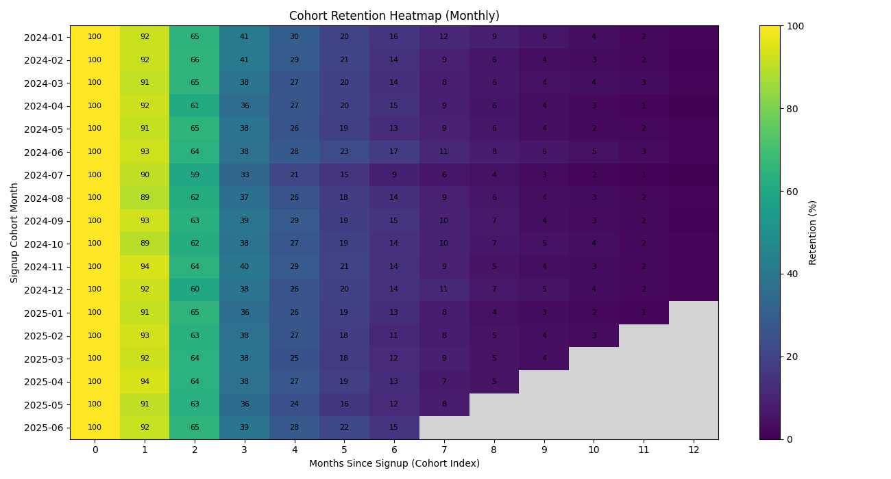
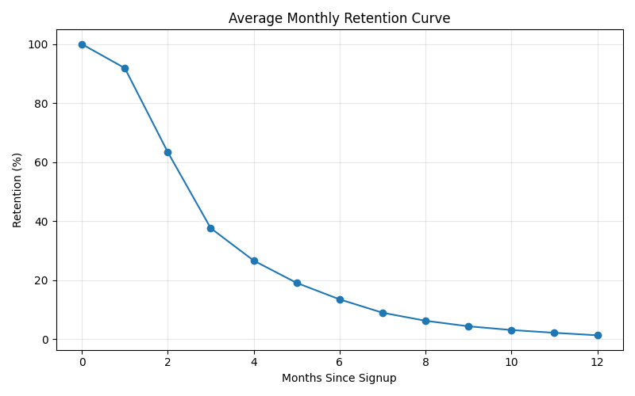
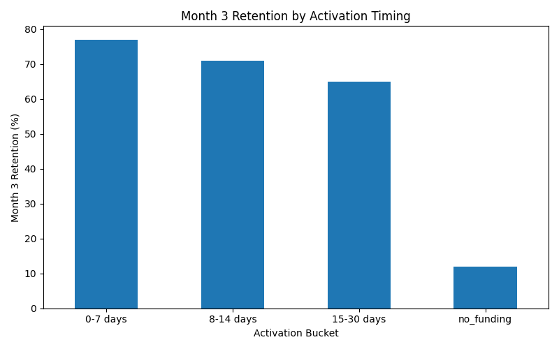
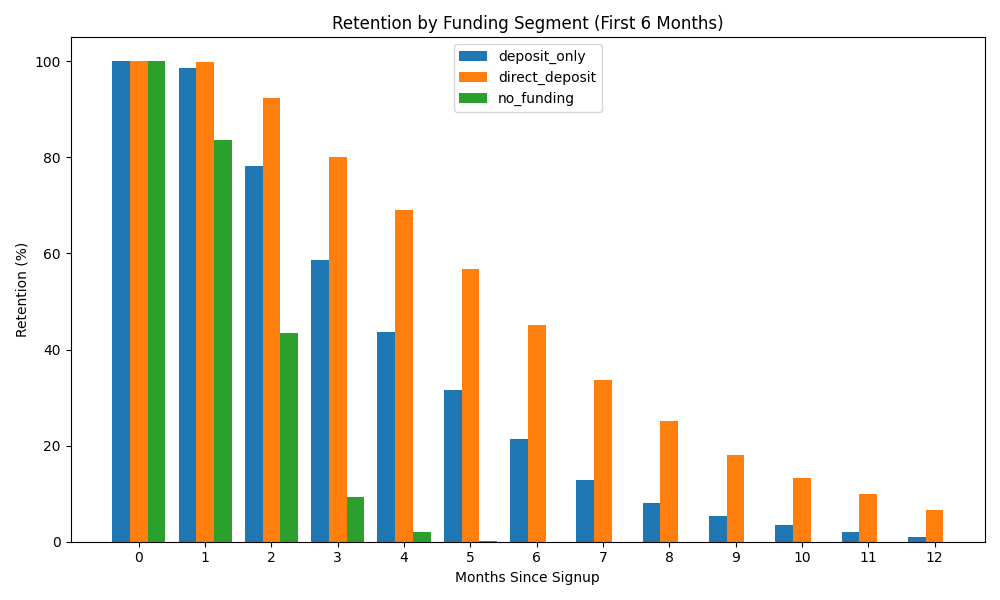

# Cohort Retention & Activation Analysis

##

## Executive Summary
This project simulates user-level behavioral data to perform a full cohort-based retention analysis. The objective is to understand early lifecycle patterns that drive long-term retention and identify activation behaviors that significantly impact Month 3 retention.

The analysis demonstrates:
- Clear early retention decay patterns
- Meaningful differences by acquisition channel
- Strong retention lift for early funding (activation)
- A measurable relationship between activation timing and 90-day retention

This framework mirrors retention analytics used by fintech or NEO Banks.

## Business Problem

User retention declines rapidly after signup. The business needs to:

- Quantify retention by cohort
- Understand early drop-off behavior
- Identify activation events (related to real usuage/ funding)
- Determine which acquisition channels drive higher quality users
- Prioritize product and lifecycle initiatives to improve Month 3 retention
  
Answering these questions helps product and growth teams prioritize onboarding improvements,activation incentives, and acquisition strategies that drive higher retention.

## Dataset & Simulation
The project uses synthetic user-level event data with:

- Signup month
- Acquisition channel (affiliate, organic, paid search, paid social, referral)
- Funding type (deposit only, direct deposit, no funding)
- Event timestamps
- Days to first funding
The simulation incorporates lifecycle decay and behavioral segmentation to resemble real-world fintech or NEO bank patterns.

## Methodology

1. Generate synthetic users across monthly cohorts
2. Simulate events and funding behavior
3. Assign activation buckets based on days to first funding
4. Compute cohort retention table (Month 0–12)
5. Calculate average retention curve
6. Segment retention by:
    - Acquisition channel
    - Funding segment
    - Activation timing

---
## Cohort Retention Analysis



**Key Observations:**
- Retention declines sharply between Month 1 and Month 3
- Month 3 retention stabilizes around 37% to 40%
- Early lifecycle is the highest impact window

---
## Average Retention Curve



**Interpretation:**
- Largest drop occurs in Months 1 to 3
- Improving early retention would shift the entire lifecycle curve

## Key Insights
1. Retention decay is front-loaded (Months 1–3)
2. Direct deposit is a powerful retention accelerator
3. Early activation (< = 7 days) yields highest retention
4. Referral and organic channels drive higher-quality cohorts
5. No-funding users churn rapidly and potentially dilute long-term LTV

---

## Activation Timing & Month 3 Retention



**Month 3 Retention by Activation Bucket:**
- 0–7 days → 77%
- 8–14 days → 71%
- 15–30 days → 65%
- No funding → 12%

Earlier activation leads to higher Month 3 retention.

---
## Retention by Funding Segment



- Direct deposit users retain significantly better across all months
- Deposit-only users show moderate retention
- No funding users churn rapidly

Funding behavior is a primary retention driver.


## Decision & Rollout Plan (Evidence-Based)

### Recommendation

Prioritize initiatives that increase early funding activation, with the goal of moving more users into the 0–7 day and 8–14 day activation buckets.

### Why (Backed by Results)

- Month 3 retention is strongly linked to activation timing shown above.
- Funding segment differences are material (direct deposit users retain best; no-funding churns fastest).
- Median time to first funding is 11 days, suggesting there is a realistic window to improve early activation with onboarding + lifecycle nudges.

## Guardrails to Monitor

- 7-day retention rate (early quality check)
- Month 3 retention rate (primary retention outcome in this analysis)
- Direct deposit adoption rate (if product goal is to increase high-retention funding segment)
- Support ticket volume (to ensure onboarding nudges don’t increase friction)

## Rollout Plan (Retention-Focused)

Gradual ramp based on retention measurement windows:

- Pilot (10%): Run for long enough to observe 7-day retention and early activation conversion
- Expand (50%): Continue monitoring Month 3 retention trend vs baseline
- Full rollout (100%): Only if Month 3 retention improves (or remains stable) and guardrails stay healthy

Rollback rule: Pause or revert if Month 3 retention declines beyond a defined threshold vs baseline or if support tickets spike.

## Next Experiment

- A/B test onboarding and lifecycle nudges designed to shorten time-to-funding, for example: “Fund account” CTA sequencing
- Incentives or reminders for direct deposit setup
- Channel-specific onboarding messaging (paid vs organic vs referral)

## Tools & Technologies
- **Python** – core analysis and simulation
- **Pandas** – data manipulation and cohort table construction
- **NumPy** – statistical simulation and lifecycle modeling
- **Matplotlib / Seaborn** – retention and segmentation visualization
- **Git & GitHub** – version control and reproducible analytics workflow

## Repository Structure

```
cohort-retention-analysis
│
├── src
│   ├── data_generation.py
│   └── cohort_analysis.py
│
├── notebooks
│   ├── 01_data_generation.ipynb
│   └── 02_cohort_analysis.ipynb
│
├── data
│   └── (generated locally)
│
├── figures
│   ├── cohort_heatmap.png
│   ├── retention_curve.png
│   ├── activation_bucket.png
│   └── funding_retention.png
│
└── README.md
```

## Reproducibility

To reproduce the full analysis locally:

### 1. Clone the repository

```bash
git clone https://github.com/shamsakhoja/cohort-retention-analysis.git
cd cohort-retention-analysis
```

### 2. Install required dependencies

```bash
pip install -r requirements.txt
```

### 3. Generate the synthetic dataset

```bash
python src/data_generation.py
```

This script simulates user-level lifecycle events and generates the dataset in:

```
data/
```

### 4. Run the cohort retention analysis

```bash
python src/cohort_analysis.py
```

This script computes cohort retention tables, activation segmentation, and generates all visualizations.

All output figures will be saved in:

```
figures/
```

### Notes

- The notebooks in the `notebooks/` folder show the original exploratory workflow.
- The `src/` scripts provide a reproducible pipeline for generating the dataset and running the full analysis.
## Author
**Shamsa Khoja**  
MS Business Analytics Candidate – University of Louisville  
LinkedIn: https://www.linkedin.com/in/shamsakhoja  
GitHub: https://github.com/shamsakhoja

Interested in roles in:
- Growth / Lifecycle Analytics
- Product Analytics
- Marketing Analytics
